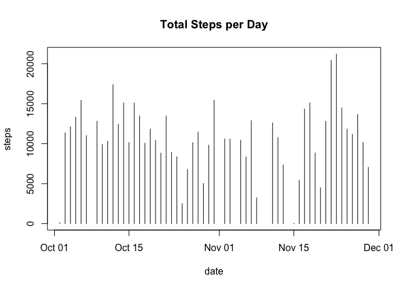
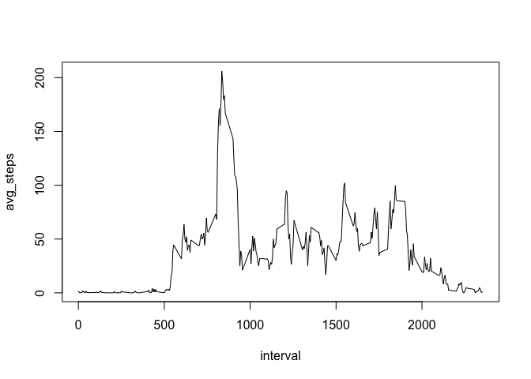
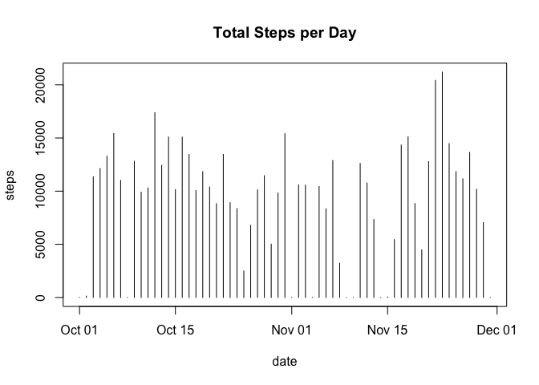
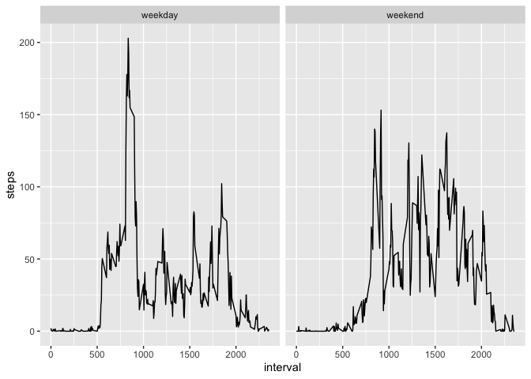

``` r
# Load necessary libraries
library(dplyr)
library(tidyr)
library(lubridate)
library(ggplot2)
```
## Loading and preprocessing the data

``` r
files_in_dir <- list.files()
if (!('activity' %in% files_in_dir) && 'activity.zip' %in% files_in_dir){
        unzip('activity.zip')   
}
data <- read.csv('activity.csv')
data$date <- as.Date(data$date)
```


## What is mean total number of steps taken per day?

``` r
sumSteps <- data %>% drop_na() %>% group_by(date) %>% summarise(steps = sum(steps), .groups='drop')

with(sumSteps, plot(date, steps, main="Total Steps per Day", type="h"))
```

<!-- -->

``` r
mean(sumSteps$steps)
```

```
## [1] 10766.19
```

``` r
median(sumSteps$steps)
```

```
## [1] 10765
```
## What is the average daily activity pattern?

``` r
intervals <- data %>% drop_na() %>% group_by(interval) %>% summarise(avg_steps = mean(steps), .groups='drop')

with(intervals, plot(interval, avg_steps, type="l"))
```

<!-- -->


## Inputing missing values

``` r
sum(is.na(data$steps))
```

```
## [1] 2304
```

``` r
# Use mean for day to fill in NAs, if still NA then 0
avgStepsPerDay <- data %>% group_by(date) %>% summarise(avg_steps = mean(steps), .groups='drop')
avgStepsPerDay[is.na(avgStepsPerDay)] <- 0

# Fill in missing data in original dataset
filledInData <- data %>% left_join(avgStepsPerDay, by="date") %>% 
        mutate(steps = coalesce(steps, avg_steps)) %>% select(steps, date, interval)

sumSteps <- filledInData %>% group_by(date) %>% summarise(steps = sum(steps), .groups='drop')

with(sumSteps, plot(date, steps, main="Total Steps per Day", type="h"))
```

<!-- -->

``` r
mean(sumSteps$steps)
```

```
## [1] 9354.23
```

``` r
median(sumSteps$steps)
```

```
## [1] 10395
```


## Are there differences in activity patterns between weekdays and weekends?

``` r
weekFilledData <- filledInData %>%
        mutate(weekend = ifelse(wday(date, week_start = 1) >= 6, "weekend", "weekday"))

avgWeekFilledData <- weekFilledData %>% group_by(interval, weekend) %>% summarise(steps = mean(steps), .groups='drop')

g <- ggplot(avgWeekFilledData, aes(interval, steps))
g <- g + geom_line() + facet_grid(. ~ weekend)
print(g)
```

<!-- -->
